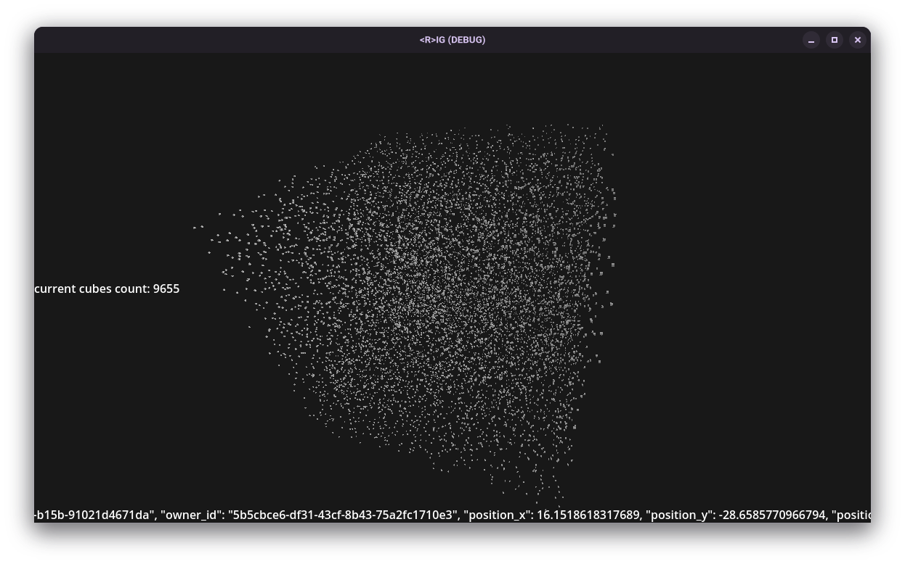

# R_IG Project

**RIG Client** — or `_R_IG`, for short — is the official client for the social network **\<R>IG**, created by [hayukimori](https://github.com/hayukimori).

Here, everyone is a cube.

There’s no feed, no scrolling, no spotlight — just a space filled with quiet presence.  
Each cube holds a profile: a name, a story, maybe a few links.  
But you won’t see any of that right away.

You choose who to discover — and when.

**This is R_IG. A space shaped by people, not impressions.**

License: Business Source License 1.1 — Non-commercial use only.  
See [LICENSE.md](./LICENSE.md) for details. Contact the author for commercial licensing.
