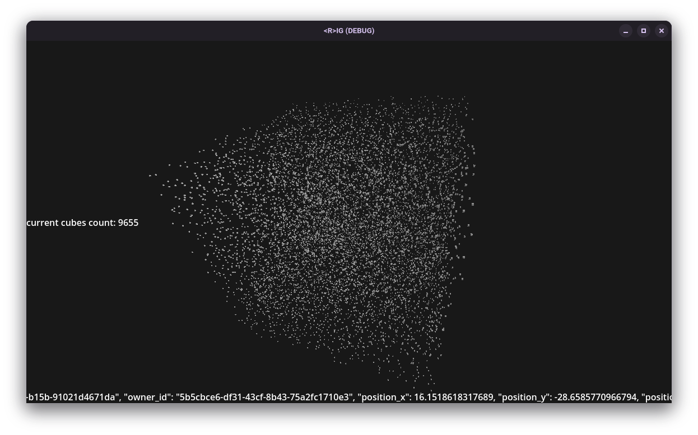

# R_IG Project

**RIG Client** — or `_R_IG`, for short — is the official client for the social network **\<R>IG**, created by [hayukimori](https://github.com/hayukimori).

Here, everyone is a cube.

There’s no feed, no scrolling, no spotlight — just a space filled with quiet presence.  
Each cube holds a profile: a name, a story, maybe a few links.  
But you won’t see any of that right away.

You choose who to discover — and when.

**This is R_IG. A space shaped by people, not impressions.**

### Typography Notice

This project uses the **Aldrich** typeface, designed by Matthew Desmond and licensed under the [SIL Open Font License 1.1](https://openfontlicense.org).

A copy of the license is available in the [`licenses/Aldrich-OFL.txt`](./licenses/Aldrich-OFL.txt) file.

## Third-Party Components

### ca-bundle.crt
This application includes a Certificate Authority bundle used for secure HTTPS communication.

- File: `certificates/ca-bundle.crt`
- Source: Based on Mozilla's certificate store, converted via curl project (https://curl.se/docs/caextract.html)
- License: Mozilla Public License 2.0
- Location: `licenses/ca-bundle-crt.MPL-2.0.txt`
- License location (full text): `licenses/MPL-2.0.txt`

This file has not been modified (only renamed for compatibility).  
It is embedded in the application binary as part of the Godot export package.

### Google Icons
This product uses Material Design Icons by Google LLC. These icons are licensed under the Apache License, Version 2.0.

A copy of the license is included in the project's 'licenses' directory and is also available at:
http://www.apache.org/licenses/LICENSE-2.0

### Project License

License: Business Source License 1.1 — Non-commercial use only.  
See [LICENSE.md](./LICENSE.md) for details. Contact the author for commercial licensing.

